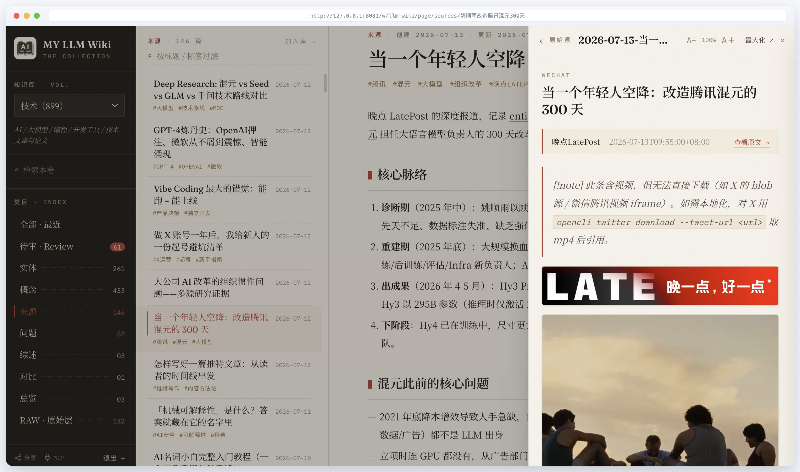
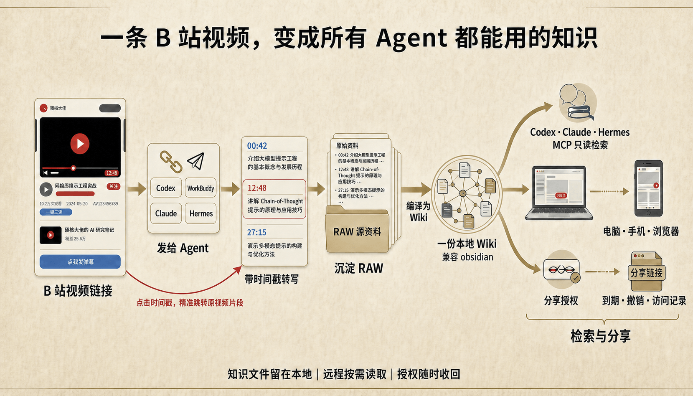

# My LLM Wiki

> 把网页、文档和视频变成可搜索、可引用、能跳回原始来源的本地知识。

My LLM Wiki 是一组 agent skills 与跨平台桌面应用。它把网页、公众号、视频、X、本地
文档和个人笔记保存为不可变 RAW，再增量编译成相互链接的 Markdown Wiki。知识文件留在
自己的电脑里，同时可供 Browser、Obsidian 和 AI Agent 检索。

项目源于 Andrej Karpathy 的 [LLM Wiki 理念](https://gist.github.com/karpathy/442a6bf555914893e9891c11519de94f)：
LLM 不只回答一次问题，而是持续把原始资料编译进一份可维护、可追溯的长期知识库。



## 从原始资料到可验证知识

```text
网页 / 文档 / 视频 / X / 笔记
  ↓  可替换的采集适配器
不可变 RAW 原件
  ↓  提取、合并、互链、Review
Markdown Wiki
  ↓
Browser / Obsidian / 有界全文检索 / AI Agent
```

视频场景会优先读取字幕；没有字幕时使用选定的本地 ASR。保存结果是带来源与跳转时间戳
的完整转写，而不是一段脱离原文的摘要：

```markdown
**[23:56](https://www.youtube.com/watch?v=<id>&t=1436s)**
这里是该时刻开始的转写内容……
```

因此检索结果既能说明“视频讲了什么”，也能回到原片的准确位置核验。



## 核心能力

| 环节 | 能力 | 主要产物 |
| --- | --- | --- |
| 采集 | 网页、公众号、文档、笔记、视频、X 帖文与 bookmarks | 自包含 Markdown、已本地化资源、来源元数据 |
| 编译 | 实体、概念、来源摘要、关联关系与轻量 Research 线索 | 可审阅、可追溯、相互链接的 Wiki 页面 |
| 维护 | Review、冲突哨兵、Deep Research、去重、增量 lint | 持续演进的知识库 |
| 检索 | FTS5 与 top-k 有界页面读取 | 带引用回答和可控大小的上下文 |
| 使用 | Browser、Obsidian、CLI；显式开启后的 MCP/远程分享 | 同一份本地知识服务于人和 Agent |

采集工具是可替换适配器。opencli、agent-reach、yt-dlp、本地 ASR 或自定义脚本取得的内容
都进入同一份 [`RAW 契约`](skills/my-llm-wiki/references/raw-contract.md)；抓取路径变化不需要
迁移已经积累的知识。

每次编译还会给出 `0–3` 个证据缺口、来源冲突或可深挖方向。只有用户选择某个方向时才进入
Deep Research，新证据仍先保存为 RAW，再编译回 Wiki。

## 本地优先与远程访问

Wiki、RAW、图片和运行状态都是普通本地文件。生成的知识库兼容 Obsidian：页面使用
Markdown、YAML frontmatter 与 `[[wikilinks]]`，初始化时也会创建 `.obsidian/` 配置。
Browser 直接读取这些文件并建立本地 FTS5 索引，不要求把知识迁移到云笔记或托管向量库。

用户可显式开启 relay，让手机或异地浏览器读取电脑上的同一份 Wiki。relay 默认关闭；
访客只能访问获准 Wiki 的页面、附件、目录、搜索和图谱，RAW、Review 与 MCP 不开放。

“本地优先”不等于托管 relay 的流量端到端不可见。中继能够看到传输明文，但当前协议不把
Wiki 正文写入 Durable Object 存储。敏感知识库可以始终关闭 relay，只使用本地 Browser、
Obsidian 或 CLI。分享授权当前以整个 Wiki 为边界，不是单页授权。

## 快速开始

推荐路径是从 [GitHub Releases](https://github.com/dake6767/llm-wiki-suite/releases/latest)
安装标准 My LLM Wiki Browser。第一次启动不会先打开 `127.0.0.1`：应用内置的 Setup
页面会先让你选择需要安装 Skills 的 Agent 宿主，一次确认后完成：

```text
完整 Skills Pack → 官方验证工具链 → Wiki 初始化 → 打开 Browser
```

确认页可以修改 Wiki 的存放路径；默认仍为 `~/wikis/my-llm-wiki`，已有 Wiki 目录会直接复用。
同一页还可以修改工具链与 Skills 的安装目录，默认仍为 `~/.my-llm-wiki`。工具链、语音模型和
Skills 合计可能 3 GB 左右，Windows 上默认全部落在系统盘并随重装丢失，因此可以改到数据盘：
此时 `~/.my-llm-wiki` 会变成指向该目录的链接（Windows 上是 junction），Skills、MCP 注册和
`wikis.json` 的既有路径全部照常工作；重装系统后把新的 `~/.my-llm-wiki` 指回原目录即可复用，
不必重新下载。
首次界面不再要求用户组合 Documents、Web、Video、中文/非中文 ASR 或失败策略。
`toolchain-base` 包含 FFmpeg、yt-dlp、aria2c、Node/OpenCLI 和文档转换。完成页会立即开放 Wiki，
并提供独立的“安装并预热”按钮：Browser 可在后台准备中文 ASR runtime、fsmn-vad 与
SenseVoiceSmall，用户无需等待即可先抓取网页。所有 pack 都由 CI 预构建和验证，用户机器
只下载、校验 SHA-256、解压和激活，不调用全局 pip/npm、Homebrew、apt 或 winget。

Skills 与工具链安装完成后，托盘只保留一个设置入口：

```text
设置…
├── Browser          # Wiki、端口、自启、分享与 relay
└── Agent            # Skills、工具链、update、repair 与人工动作
```

统一设置窗口仍保留安全分界：Browser 配置使用带 Owner 凭证的本机 API，Skills 与工具链直接
调用 Tauri Setup Core，安装和修复能力不会进入 `127.0.0.1` 或 relay。

之后新装了别的 Agent，不必重跑安装：「Skills 与工具链」页的 Skills Pack 面板列出全部已知宿主，
可以逐个把已经装好的那份 Skills Pack 装给它，或者把某个宿主摘掉。新增只建链接，不联网、
不重新下载工具链；遇到同名外来 Skill 仍然逐项授权后才备份替换。移除只摘该宿主的链接，
安装目录里的 Skills Pack、能力包与 Wiki 都保留。

无界面 Agent 可以下载 Release 中的独立 CLI；Browser 也会把它安装到：

```text
~/.my-llm-wiki/bin/my-llm-wiki
```

CLI 与 GUI 调用同一个 Rust Setup Core：

```bash
my-llm-wiki inspect --json
my-llm-wiki setup --host codex --wiki-path ~/wikis/my-llm-wiki --json
my-llm-wiki setup --host codex --install-root D:\my-llm-wiki --json
my-llm-wiki add-host --host claude --json
my-llm-wiki uninstall --host claude --json
my-llm-wiki status --json
my-llm-wiki update --check --json
my-llm-wiki update --json
my-llm-wiki repair --json
```

最小状态写在 `~/.my-llm-wiki/setup-state.json`，Provider 偏好写在
`~/.my-llm-wiki/providers.json`。repair、update 和 uninstall 只触碰 Setup Core 能证明拥有的
路径；Wiki、RAW、自定义 Provider 与外来 Skills 永远按用户数据保留。

官方工具链是推荐并默认优先的 Provider，因为它通过了项目 SOP；它不是唯一实现。用户可以在
Setup 中为某项能力保存 system/custom Provider，也可以在单次任务里临时指定，产物仍需通过
同一套 RAW、来源、字幕与完整性检查。只安装 Skills、不安装 Browser 的开放路径同样受支持。

完整的 Agent/CLI 操作边界见 [`AGENTS.md`](AGENTS.md)。MCP 不属于初始安装；只有用户之后
明确提出时才单独配置。

安装完成后，直接给 agent 一份真实资料：

```text
把这个视频保存到我的 Wiki，保留完整转写和可跳转时间戳，然后整理成知识页面：<URL>
```

## 组件状态

| 组件 | 职责 | 状态 |
| --- | --- | --- |
| [`my-llm-wiki`](skills/my-llm-wiki/SKILL.md) | Wiki 路由、网页/文档/note 采集、RAW 契约 | Stable |
| [`my-llm-wiki-video`](skills/my-llm-wiki-video/SKILL.md) | 在线视频 → 带时间戳完整转写 | Preview |
| [`my-llm-wiki-x`](skills/my-llm-wiki-x/SKILL.md) | X 单帖/长文与 bookmarks 增量同步 | Preview |
| [`my-llm-wiki-maintainer`](skills/my-llm-wiki-maintainer/SKILL.md) | 编译、Review、Research、去重与 lint | Stable |
| [`my-llm-wiki-search`](skills/my-llm-wiki-search/SKILL.md) | 只读检索、引用回答和上下文预算 | Preview |
| [`cn-mirrors`](skills/cn-mirrors/SKILL.md) | 受限网络探测与分生态镜像路由 | Stable |
| [`My LLM Wiki Browser`](apps/my-llm-wiki-browser/) | Setup、阅读、FTS、MCP、远程访问与分享 | Released · v2 |

Preview 表示能力已参与完整 Skills Pack，但部分来源或平台覆盖仍在收敛。

## 仓库结构

```text
llm-wiki-suite/
├── AGENTS.md                       # Browser / CLI / Provider 操作边界
├── apps/my-llm-wiki-browser/       # Browser、Setup Core/GUI、CLI、MCP、relay
├── registry/
│   ├── pack-build-*.lock.json      # Release pack 的直接上游与运行时锁
│   ├── requirements/               # 各平台完整 Python 依赖与 SHA-256
│   ├── opencli/                    # OpenCLI 完整 npm lock
│   └── pack-release.json           # 不可变 pack 版本与输入摘要
├── scripts/
│   ├── build_distribution.py       # CI 构建不可变工具链 pack
│   ├── merge_pack_indexes.py
│   ├── compose_distribution.py
│   └── stage_cli.py                # 构建 CLI 与 Tauri sidecar
└── skills/<slug>/                  # SKILL.md、scripts、references、assets
```

Browser 是可选组件。没有 Browser 时，采集、编译、维护和本地有界检索仍可使用；安装后
增加桌面阅读、FTS 索引、MCP、远程访问和分享能力。

## 开发与维护

提交前至少运行：

```bash
python3 -m unittest scripts.test_distribution scripts.test_approval_safe
python3 -m unittest discover -s skills/my-llm-wiki/scripts -p 'test_*.py'
python3 -m unittest discover -s skills/my-llm-wiki-video/scripts -p 'test_*.py'
python3 scripts/check_approval_safety.py
```

Browser 的前端构建、Rust 测试与 Tauri 开发命令见
[`apps/my-llm-wiki-browser/README.md`](apps/my-llm-wiki-browser/README.md)。Setup Core 直接在编译时
嵌入 `skills/` 中含 `SKILL.md` 的完整目录，因此新增 Skill 不需要维护第二份安装注册表。
