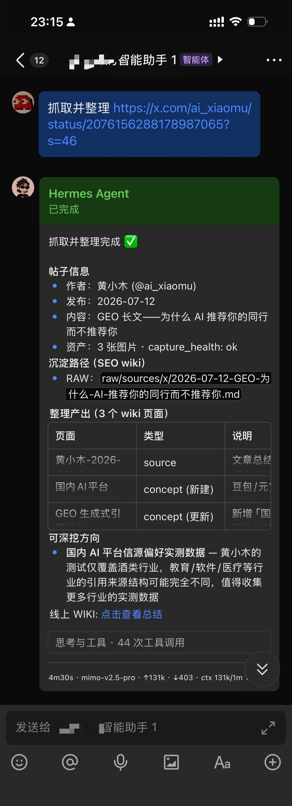

# My LLM Wiki

> **把视频变成可搜索、可引用、能跳回原片的知识。**
>
> 从网页、公众号、视频、X 和本地文档采集内容，编译成相互链接的 Markdown Wiki；
> 知识文件保留在自己的电脑里，同时可供桌面、手机和 AI Agent 检索与使用。

`llm-wiki-suite` ，包含一组 agent skills 和跨平台桌面应用 **My LLM Wiki Browser**。它覆盖知识从采集、编译、维护到读取、溯源和分享的完整生命周期。

本项目基于 Andrej Karpathy 提出的 [LLM Wiki 理念](https://gist.github.com/karpathy/442a6bf555914893e9891c11519de94f)：让 LLM 将原始资料增量编译为一份持久、互联、持续积累的 Wiki，并在此基础上补齐**内容采集**、**桌面浏览**、**检索**、**远程WEB访问**与**分享**。

[快速开始](#快速开始) · [视频如何变成知识](#一个视频如何变成可验证的知识) ·
[完整能力](#不止于视频) · [轻量 Research](#整理时也会发现下一步值得研究什么) · [本地与远程](#知识留在本地也能在线使用) ·
[组件状态](#组件与状态)


## 一个视频如何变成可验证的知识

给 agent 一条 YouTube、Bilibili、抖音或小红书视频链接，My LLM Wiki 会优先读取
原字幕；没有字幕时，可下载临时音频并使用本地 ASR。最终保存的是带来源信息和
跳转时间戳的完整转写，而不是一段脱离原文的摘要。


```text
在线视频
  ↓  字幕优先 / 本地 ASR fallback
带时间戳的完整转写
  ↓  每段保留跳回原视频的深链
不可变 RAW 原件
  ↓  提取、合并、互链、Review
Markdown Wiki
  ↓
Browser / 全文检索 / MCP / AI Agent
```

转写中的片段形如：

```markdown
**[23:56](https://www.youtube.com/watch?v=<id>&t=1436s)**
这里是该时刻开始的转写内容……
```

因此，一次检索不仅能找到“视频讲了什么”，还能回答“这句话在原视频的什么位置”，
并一键回到对应片段核验。

- 保留完整、轻度校正的转写，不用摘要替代原内容。
- 时间戳贯穿原文；非中文视频可附带保留相同锚点的完整中文译文。
- 本地只保存转写、来源链接和封面，不长期保存视频文件。
- 转写进入 RAW 后，可以继续编译成来源页、概念页和相互链接的知识。

视频 RAW 的具体契约见
[`raw-contract.md`](skills/my-llm-wiki/references/raw-contract.md#online-video-source_type-video)，
采集流程见 [`my-llm-wiki-video`](skills/my-llm-wiki-video/SKILL.md)。

## 不止于视频

| 环节 | My LLM Wiki 做什么 | 产物 |
| --- | --- | --- |
| 采集 | 网页、公众号、文档、个人笔记、在线视频、X 帖文与 bookmarks | 自包含 Markdown、已本地化图片、来源元数据 |
| 编译 | 从 RAW 提取实体、概念、来源摘要与关联关系，增量合并并提出可深挖方向 | 可审阅、可追溯、相互链接的 Wiki 页面与 Research 线索 |
| 维护 | Review、冲突哨兵、Deep Research、去重、增量 lint、答案回存 | 持续演进而非一次性生成的知识库 |
| 检索 | 本地全文检索优先，只读取 top-k 候选页并执行硬上下文预算 | 带引用的回答和可控大小的上下文包 |
| 使用 | Browser、本地/远程 MCP、CLI fallback、限时分享 | 同一份本地知识服务于人和 Agent |

RAW 是可追溯的来源层，Wiki 是可继续维护的知识层。确定性的路径检查、缓存、索引合并、
Review 写入和 lint 交给脚本；语义分析、合成、保守合并与冲突判断交给 LLM。

## 整理时，也会发现下一步值得研究什么

每次把 RAW 编译进 Wiki 时，Agent 不只负责归纳和互链，还会判断资料中有哪些证据缺口、
来源冲突或值得继续追问的线索，并给出 `0–3` 个“可深挖方向”。这相当于随每次整理附带
一轮**轻量 Research**：先帮你发现好问题，不自动展开大规模搜索。

当某个方向值得投入时，只需回复 `research <标题>`，Agent 就会按需进入 Deep Research；
新找到的证据仍先保存到 RAW，再编译回 Wiki。于是“采集 → 整理 → 发现问题 → 深挖 →
回写知识库”形成持续演进的闭环，而不是生成一次摘要后就结束。

### 支持的内容入口

- **网页 / 公众号 / 小红书图文**：正文转为自包含 Markdown，图片尽量本地化。
- **在线视频**：字幕优先，本地 ASR fallback，生成可跳回原片的时间戳转写。
- **X / Twitter**：单帖、长文、媒体与 bookmarks 增量同步，按 tweet id 去重并支持恢复。
- **本地文档**：PDF、DOCX、PPTX、XLSX、EPUB 等先保留原文件，再提供可检索的文本抽取。
- **个人笔记**：把自己的想法作为一等来源，与外部资料一起编译。

实际抓取路径取决于平台、登录状态和本机工具链。`doctor.py` 会按所选能力检查依赖、
说明降级路径并给出安装建议，但不会静默安装外部工具。

## 知识留在本地，也能在线使用

Wiki、RAW、图片和运行状态都是用户文件系统中的普通文件。Browser 直接读取这些文件，
使用本地 FTS5 全文索引提供搜索，不要求先把知识迁移到云笔记或托管向量数据库。

生成的知识库兼容 **Obsidian**：页面使用 Markdown、YAML frontmatter 和 `[[wikilinks]]`，
初始化时会生成 `.obsidian/` 配置，并把 `raw/assets/` 设为附件目录。整个 Wiki 可直接作为
Obsidian vault 打开；My LLM Wiki Browser 提供额外的检索、溯源、MCP 和远程访问能力，
知识内容不被锁定在专有格式中。

一个典型场景是：当 Agent 已接入 IM 时，你可以直接在聊天中发来一篇文章或一段视频，
远程发起“抓取并整理”任务。Agent 在运行本套件的电脑上完成 `capture → RAW → Wiki` 后，
会把具体结果页的**线上 WIKI 链接**发回会话；你可以立即用手机或异地浏览器打开查看，
无需远程操作那台电脑，而知识原件与 Wiki 文件仍保留在本地。

<p align="center">
  
</p>

需要跨设备访问时，可由用户显式开启 relay：

- 手机和远程浏览器读取的仍是电脑上的同一份 Wiki。
- Owner 可以通过远程 MCP 检索知识；本地 MCP 默认通过 suite 自带的 stdio bridge 连接。
- 每个访客分享授权可以设置有效期、续期、查看最后访问时间或立即撤销。
- Guest 只能读取获准 Wiki 的页面、附件、目录、搜索和图谱；RAW 目录、Review 和 MCP 不开放。
- relay 默认关闭，Browser 不在运行或 relay 断开时，远程访问随之停止。

### 信任边界

“本地优先”指知识库**不被复制并托管到第三方知识数据库**，不代表远程流量端到端不可见。
开启托管 relay 后，中继能够看到传输明文；当前协议按流式请求转发，不把 Wiki 正文写入
Durable Object 存储。敏感知识库可以保持 relay 关闭，只使用本地 Browser、MCP 或 CLI。**当然，你也可以自己搭建中继服务器访问你本地电脑的 WIKI 库**。

当前分享授权的权限范围是**整个 Wiki**，页面链接只是该 Wiki 内的落点，并非单页级授权。
托管 relay 的服务端由项目单独运营，服务端源码当前不在本仓库中；客户端 connector、
本地鉴权和分享权限实现位于 [`apps/my-llm-wiki-browser/`](apps/my-llm-wiki-browser/)。

## 为人阅读，也为 Agent 提供上下文

Browser 暴露六个只读 MCP 工具：

```text
list_wikis      search_wiki      read_page
read_pages      read_raw         list_wiki_tree
```

典型读取路径是“先搜索，再批量读取少量候选页”，而不是让模型遍历整个 Wiki。
`read_pages` 对页数、单页字符数和总字符数都有上限；Browser 不可用时，skills 会退回
等价的本地有界检索。

安装注册已覆盖 Codex、Claude、Hermes、WorkBuddy和通用 Agents 目录。MCP 是首选访问形式，
但不是硬依赖：没有 MCP 的宿主仍可通过同一套 `wiki_ops.py` 查询和读取。而不过多消耗你的 Token。

## 快速开始

### 推荐：把仓库 URL 交给 agent

本仓库根目录的 [`AGENTS.md`](AGENTS.md) 是端到端安装协议。GitHub 是 canonical
源仓库，Gitee 是自动 Pull 的中国大陆只读镜像；两边保持同一提交。可以把当前网络可达的
任一地址交给支持本地命令的 agent：

```text
安装 https://github.com/dake6767/llm-wiki-suite ，
然后带我完成第一次 capture → RAW → Wiki → Browser。
```

```text
安装 https://gitee.com/dake6767/llm-wiki-suite ，
然后带我完成第一次 capture → RAW → Wiki → Browser。
```

agent 会复用已有 checkout，或安装到稳定目录 `~/.my-llm-wiki/suite`；随后同步 skills、
检查所选抓取工具链、初始化 Wiki、安装 Browser，并引导完成第一次采集。

### 手动安装 skills

先下载并审阅独立 bootstrap 脚本，不使用 `curl | bash`。全球入口：

```bash
curl -fsSLo bootstrap.sh \
  https://raw.githubusercontent.com/dake6767/llm-wiki-suite/main/bootstrap.sh
less bootstrap.sh
bash bootstrap.sh
```

中国大陆入口：

```bash
curl -fsSLo bootstrap.sh \
  https://gitee.com/dake6767/llm-wiki-suite/raw/main/bootstrap.sh
less bootstrap.sh
bash bootstrap.sh \
  --repo-url https://gitee.com/dake6767/llm-wiki-suite.git
```

默认安装使用软链，checkout 是长期 source of truth，不应放在临时目录。脚本会将 active
skills 同步到已存在的 Codex、Claude、Hermes、Agents 和 WorkBuddy skill 目录。未显式
指定 `--repo-url` 时，fresh install 会短时探测 GitHub；不可达时优先 Gitee，clone 失败时
再尝试另一入口。已有 checkout 始终沿其 `origin` 更新。

常用选项：

```bash
bash bootstrap.sh my-llm-wiki-video   # 只选视频能力及其依赖
bash bootstrap.sh my-llm-wiki-x       # 只选 X 能力及其依赖
bash bootstrap.sh --dry-run           # 预览，不修改
bash bootstrap.sh --update            # clean checkout 上执行 ff-only 更新
```

### 安装 Browser

Browser 默认优先下载与当前操作系统匹配的 GitHub Release；没有匹配资产时才使用源码构建：

```bash
python3 scripts/install-browser.py --open
```

release 提供 macOS Apple Silicon / Intel、Windows 安装包与 portable zip，以及 Linux
AppImage / deb / rpm。当前产物尚未完成 Apple 公证和 Windows 代码签名，浏览器下载后
首次运行可能需要在系统安全提示中手动放行。

安装后可按明确授权注册本地 MCP：

```bash
python3 scripts/install-browser.py --register-mcp
```

### 检查安装

```bash
python3 scripts/doctor.py
python3 scripts/doctor.py --json
python3 scripts/doctor.py --skills my-llm-wiki-video
```

`doctor` 一次检查 skill 链接、运行时依赖、Wiki 注册表、Browser 可达性、MCP 注册和所选
采集工具链。缺失的外部 fetcher / ASR 工具只会被报告，不会自动安装。

完成安装后，可以从一句话开始：

```text
把这个视频保存到我的 Wiki，保留完整转写和可跳转时间戳，然后整理成知识页面：<URL>
```

## 组件与状态

| 组件 | 职责 | 当前状态 |
| --- | --- | --- |
| [`my-llm-wiki`](skills/my-llm-wiki/SKILL.md) | Wiki 路由、网页/文档/note 采集、RAW 契约与 synthesis handoff | Stable · published |
| [`my-llm-wiki-video`](skills/my-llm-wiki-video/SKILL.md) | 在线视频 → 带跳转时间戳的完整转写 | Preview · active in suite |
| [`my-llm-wiki-x`](skills/my-llm-wiki-x/SKILL.md) | X 单条/长文抓取与 bookmarks 增量同步 | Preview · active in suite |
| [`my-llm-wiki-maintainer`](skills/my-llm-wiki-maintainer/SKILL.md) | RAW 编译、Review、Research、去重、lint、查询回存 | Stable · published |
| [`my-llm-wiki-search`](skills/my-llm-wiki-search/SKILL.md) | 只读检索、引用回答和硬上下文预算 | Preview · active in suite |
| [`cn-mirrors`](skills/cn-mirrors/SKILL.md) | 受限网络探测与国内镜像安装建议 | Stable · published |
| [`My LLM Wiki Browser`](apps/my-llm-wiki-browser/) | 桌面/Web 阅读、FTS 搜索、MCP、远程访问与分享 | Released · v1.0.13 |

这里的 Preview 表示源码已在 suite 中并参与安装，但独立发布、平台覆盖或对外文档仍在收敛。
安装前以 [`registry/skills.json`](registry/skills.json) 中的 lifecycle、依赖和 capability 声明为准。

## 仓库结构

```text
llm-wiki-suite/
├── bootstrap.sh              # 可独立下载的 agent-first 安装入口
├── AGENTS.md                 # 给 agent 的端到端安装与首次使用协议
├── apps/
│   └── my-llm-wiki-browser/  # Tauri / Rust / React / MCP / relay connector
├── registry/
│   ├── skills.json           # skills、依赖、bundles、capabilities 的事实源
│   └── bootstrap.json        # 安装目标、Browser release、MCP 注册的事实源
├── scripts/
│   ├── install.sh            # 精细控制 skills 安装
│   ├── install-browser.py    # release-first Browser 安装与 MCP 注册
│   └── doctor.py             # suite 级健康检查
└── skills/<slug>/            # SKILL.md + scripts / references / assets
```

Browser 是可选组件：没有 Browser 时，采集、编译、维护和本地有界检索仍可使用；安装 Browser后增加桌面阅读、FTS 索引、MCP、远程访问和分享能力。

## 开发与维护

已经进入仓库开发时，可以用底层安装命令精细控制目标：

```bash
scripts/install.sh --dry-run
scripts/install.sh
scripts/install.sh my-llm-wiki-video
scripts/install.sh --target ~/.codex/skills --target ~/.agents/skills
```

提交前至少运行：

```bash
python3 scripts/doctor.py --json
python3 scripts/check_approval_safety.py
python3 -m unittest scripts.test_approval_safe -v
```

Browser 的前端构建、Rust 测试和 Tauri 开发命令见
[`apps/my-llm-wiki-browser/README.md`](apps/my-llm-wiki-browser/README.md)。

新增或调整 skill 时，请同时更新 [`registry/skills.json`](registry/skills.json)：
`requires` 表示运行时依赖，`bundles` 表示门面默认一起安装的 companion skills，
`capabilities` 用于让 `doctor` 只检查用户实际选择的抓取工具链。
